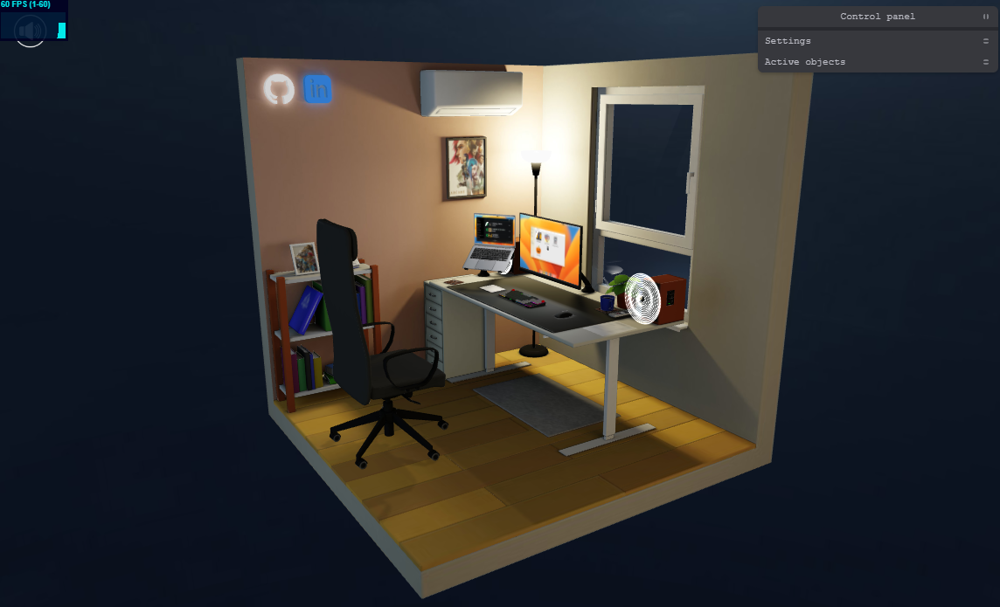

# My Interactive Workspace

<p align="center">
  
</p>

**Live: [andriibabintsev.com](https://www.andriibabintsev.com/)**

In this project, I have created my workplace in 3D with numerous interactive objects. You can move the chair, open window, turn on the air conditioner, open book, play music, play the «Transfer it» game, and much more. Feel free to explore and interact with it!

## Interactive objects

There are 14 active objects in this project. To highlight all the active objects, you can use the «Highlight active objects» button located in the control panel.
For each object I tried to add some interesting interactions. Here are a few examples:

- The window can be opened in two ways: standard and ventilation
- The keyboard has 9 different highlight types. Each key can be pressed, including the keys on a real keyboard. Some keys have specific functionalities. For instance, pressing F8 will «play/pause» the song, F10 will «mute», and F12 will «increase the volume»
- The speed and size of particles from the air conditioner are dependent on the temperature set on the air conditioner remote
- Inside the locker, you can find a photo of my real workspace

Furthermore, there is a control panel located in the top right corner. It provides options for general settings such as displaying the FPS meter, adjusting the volume, playing an intro, and more. Additionally, each active object has its own folder in control panel for specific settings.

## Game «Transfer it»

Additionally, there is a small and enjoyable game included in the project. The goal of the game is to correctly place furniture in their designated locations. Some levels feature a robot vacuum cleaner that you must avoid damaging. The controls are quite simple: either click on the screen or press the Spacebar or Enter key. Challenge yourself to complete all 10 levels!

## Some technical details and links
- 3D engine: [Three.js](https://threejs.org/)
- 2D engine: [Blacksmith 2D](https://blacksmith2d.io/)
- Physics for the «Transfer it» game: [Cannon-es](https://pmndrs.github.io/cannon-es/)
- Intro camera movement: [Theatre.js](https://www.theatrejs.com/)
- Reading pdf: [PDF.js](https://mozilla.github.io/pdf.js/)
- Control panel: [Tweakpane](https://cocopon.github.io/tweakpane/)
- All models (except the «Transfer it» game) are done with [Blender](https://www.blender.org/)
- Inspired by [«My room in 3D» by Bruno Simon](https://my-room-in-3d.vercel.app/)

## How to install

# node version 17.3.0
Download [Node.js](https://nodejs.org/en/download). Run this followed commands:

```
# Install dependencies
npm install

# Run the local server at localhost:5173
npm start

# Build for production in the dist/ directory
npm run build
```
